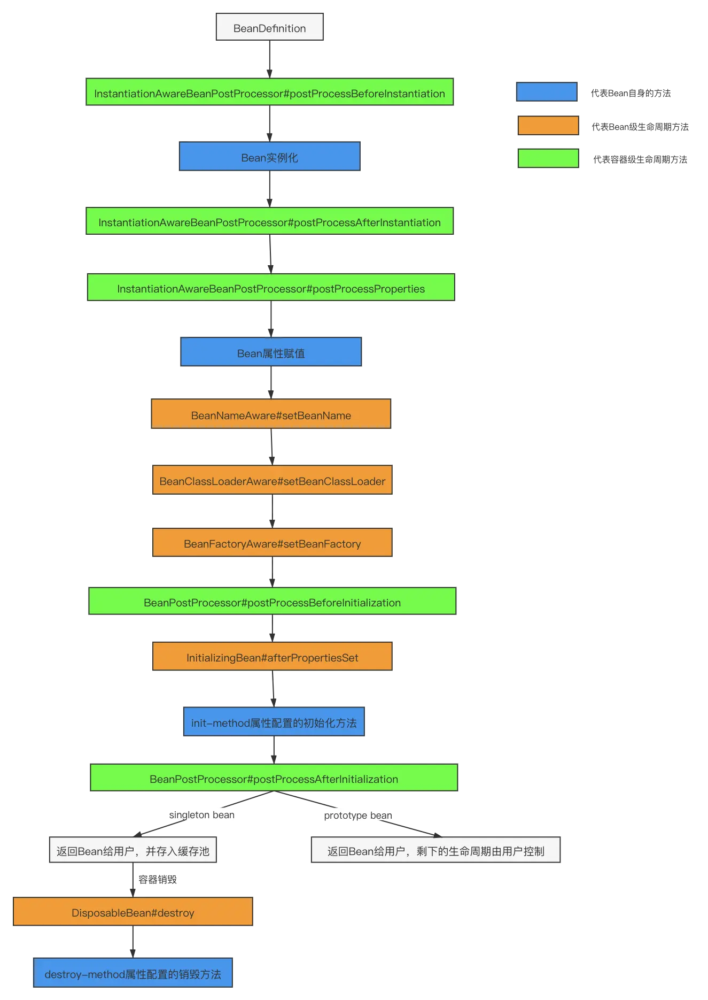

## Spring 概述
### 

### 什么是Spring？

Spring是一个轻量级Java开发框架，是为了解决企业级业务开发的业务逻辑层和其他层的耦合关系。Spring最根本是使命是简化Java开发，让Java开发者专注于程序的开发。

### Spring的优缺点

优点

- 方便解耦，简化开发

  可以将所有对象的创建和依赖关系的维护交给Spring管理。

- AOP编程支持

  Spring提供面向切面编程，可以方便地实现对程序进行拦截，监控等功能。

- 声明式事务支持

  只需要配置就能完成对事务的管理，无需手动编程

- 方便集成各种优秀框架

缺点

- Spring明明是一个很轻量级的框架，却给人感觉大而全
- Spring依赖反射，反射影响性能

### Spring由哪些模块组成

- Spring Core：提供了框架最基本的组成部分，包括控制反转（IOC）和依赖注入(DI)功能。
- Spring Beans：提供了BeanFactory，是工厂模式的一个经典实现，Spring将管理对象称为Bean。
- SpringContext：负责实例化、配置和组装Bean
- Spring AOP：提供了面向切面的编程实现，可以自定义拦截器
- Spring Web：网络相关模块
- Spring Data Access：数据库相关模块
- SpringTest：测试相关模块

## IOC

### IOC（Inverse of  Control）

IoC是一种设计思想，而不是一个具体的技术实现。IoC的思想就是将原本在程序中手动创建对象的控制权，交给Spring来管理。

比如要实例化一个Service，这个Service可能依赖了很多类，那我们要搞清楚每一个类的构造函数，这很麻烦。利用IoC，只需要配置好，然后在需要的地方引用就行了。

IoC容器是Spring用来实现IoC的载体，IoC容器实际上是个Map，实现原理是工厂模式加反射机制。

### BeanFactory & ApplicationContext

BeanFactory和ApplicationContext是Spring的两大核心接口，都可以当做Spring的容器。ApplicationContext是BeanFactory的子接口。

- BeanFactory：可以简单理解为一个HashMap，Key是BeanName，Value是Bean实例。通常只提供put和get两个功能。
-
ApplicationContext：是一个高级容器，它比BeanFactory多了很多功能。它支持BeanFactory工具类，访问文件资源，事件发布通知，接口回调等功能。它内部定义了一个refresh方法，用于刷新整个容器，重新加载所有的Bean。


## Spring Beans

### 什么是SpringBean？

一句话，被IoC容器管理的对象。

我们需要告诉IoC容器帮我们管理哪些对象，这个是通过配置元数据来定义的。配置元数据可以是XML文件、注解或Java配置类。

### 将一个类声明为Bean的注解有哪些？

- @Component：通用注解，
- @Repository：持久层（DAO）层注解
- @Service
- @Controller

### 注入Bean的注解有哪些？

- @Autowired：Spring提供的注解，默认注入方式是byType，可以用@Qualifier来显示指定名称
- @Resource：JDK提供的注解，默认是byName，可以用name属性来显示指定名称

### Bean的作用域

- singleton：唯一实例，Spring中的bean默认都是单例的
- prototype：每次请求都创建一个新的bean实例
- request：每次HTTP请求都产生一个新的bean，该bean仅在HTTP request内有效
- session：HTTP session内有效
- global-session：全局session作用域。Spring5已经没有了。

### Bean的生命周期


Spring Bean生命周期总的来说分四步

实例化 → 属性赋值 → 初始化 → 销毁

protected Object doCreateBean(String beanName, RootBeanDefinition mbd, @Nullable Object[] args) throws
BeanCreationException {
BeanWrapper instanceWrapper = null;
if (mbd.isSingleton()) {
instanceWrapper = (BeanWrapper)this.factoryBeanInstanceCache.remove(beanName);
}

```java
protected Object doCreateBean(String beanName,RootBeanDefinition mbd,@Nullable Object[]args)throws BeanCreationException{
        BeanWrapper instanceWrapper=null;
        if(mbd.isSingleton()){
        instanceWrapper=(BeanWrapper)this.factoryBeanInstanceCache.remove(beanName);
        }

        if(instanceWrapper==null){
        // 实例化阶段
        instanceWrapper=this.createBeanInstance(beanName,mbd,args);
        }

        ...

        Object exposedObject=bean;

        try{
        // 属性赋值阶段
        this.populateBean(beanName,mbd,instanceWrapper);
        // 初始化阶段
        exposedObject=this.initializeBean(beanName,exposedObject,mbd);
        }catch(Throwable var18){
        ...
        }

        ...
        }
//销毁在容器关闭时调用
```

代码详见：https://github.com/coadfarmer/spring-demo-beanCycle

详细流程图



1. 实例化（Instantiation）：利用反射调用构造方法实例化Bean
2. 属性赋值（Populate）：调用set（）方法
3. 初始化（Initialization）
    1. 检查Aware的相关接口并设置相关依赖
        - Spring检测到Bean实现了Aware接口，会注入相应的依赖。通过让Bean实现Aware接口，能在bean中获得相应的Spring容器资源
        - BeanNameAware：注入当前Bean对应的Bean Name；
        - BeanClassLoaderAware：注入加载当前Bean的ClassLoader；
        - BeanFactoryAware：注入当前BeanFactory容器的引用。
    2. BeanPostProcessor前置处理方法postProcessBeforeInlitialization()方法
        - 执行ApplicationContextAware方法，注入ApplicationContextAware
    3. 实现InitializingBean接口中的afterPropertiesSet()方法
        - afterPropertiesSet()写一些初始化逻辑，比如校验
    4. 是否配置自定义的init-method方法
    5. BeanPostProcessor后置处理
4. 销毁（Destruction）
    1. 调用DisposableBean中的destroy（）方法
    2. 如果配置文件中定义了destroy-method属性，执行相应方法

### 单例Bean的线程安全问题

无状态Bean是线程安全的，有状态Bean是线程不安全的

- 无状态Bean：没有实例变量的对象，不能保存数据，是不变类。比如DAO,Service
- 有状态Bean：有实例变量的对象，能保存数据

解决方法：

- 把Bean的作用域改为prototype
- 使用ThreadLocal

## AOP

### 什么是AOP？

- 定义：AOP（Aspect-Oriented Programming），即面向切面编程
- 作用：能够酱那些与业务无关，却为业务模块所共同调用的逻辑（例如事务处理、日志管理、权限控制）封装起来，便于减少系统重复的代码，增加模块化，降低模块间耦合度，并且有利于未来的可扩展性和可维护性。
- 实现原理：SpringAOP是基于动态代理的，如果要代理的对象实现了某个接口，那么SpringAOP会使用JDK动态代理去创建代理对象；如果没有实现接口，就会使用CGLIB代理创建代理对象。

### Spring  AOP和AspectJ AOP有什么区别

SpringAOP基于动态代理，属于运行时增强，AspectJ基于静态代理，属于编译时增强。

AspectJ的功能比Spring的功能更强大，而且速度更快。所以Spring直接集成了AspectJ。

## Spring

### Spring框架中用了哪些设计模式

- **工厂设计模式** : Spring 使用工厂模式通过 `BeanFactory`、`ApplicationContext` 创建 bean 对象。
- **代理设计模式** : Spring AOP 功能的实现。
- **单例设计模式** : Spring 中的 Bean 默认都是单例的。
- **模板方法模式** : Spring 中 `jdbcTemplate` 等以 Template 结尾的对数据库操作的类，它们就使用到了模板模式。
- **包装器设计模式** : 我们的项目需要连接多个数据库，而且不同的客户在每次访问中根据需要会去访问不同的数据库。这种模式让我们可以根据客户的需求能够动态切换不同的数据源。
- **观察者模式:** Spring 事件驱动模型就是观察者模式很经典的一个应用。
- **适配器模式** : Spring AOP 的增强或通知(Advice)使用到了适配器模式、spring MVC 中也是用到了适配器模式适配`Controller`。

### Spring事务

#### Spring 管理事务的方式有几种？

- **编程式事务** ： 在代码中硬编码(不推荐使用) : 通过 `TransactionTemplate`或者 `TransactionManager` 手动管理事务，实际应用中很少使用，但是对于你理解 Spring
  事务管理原理有帮助。
- **声明式事务** ： 在 XML 配置文件中配置或者直接基于注解（推荐使用） : 实际是通过 AOP 实现（基于`@Transactional` 的全注解方式使用最多）

#### Spring事务的传播行为？

Spring事务传播行为说的是，当多个事务同时存在的时候，Spring如何处理这些事务的行为

- PROPAGATION_REQUIRED：@Transactional默认传播行为，如果当前存在事务，就加入该事务，如果当前没有事务，就**创建一个新事务**。
- PROPAGATION_SUPPORTS：支持当前事务，如果当前存在事务，就加入该事务，如果当前不存在事务，就**以非事务执行**。
- PROPAGATION_MANDATORY：支持当前事务，如果当前存在事务，就加入该事务，如果当前不存在事务，**就抛出异常**。
- PROPAGATION_REQUIRES_NEW：创建新事务，无论当前存不存在事务，都创建新事务。
- PROPAGATION_NOT_SUPPORTED：以非事务方式执行操作，如果当前存在事务，就把当前事务挂起。
- PROPAGATION_NEVER：以非事务方式执行，如果当前存在事务，则抛出异常。
- PROPAGATION_NESTED：如果当前存在事务，则在**嵌套事务内执行**。如果当前没有事务，则按REQUIRED属性执行。


