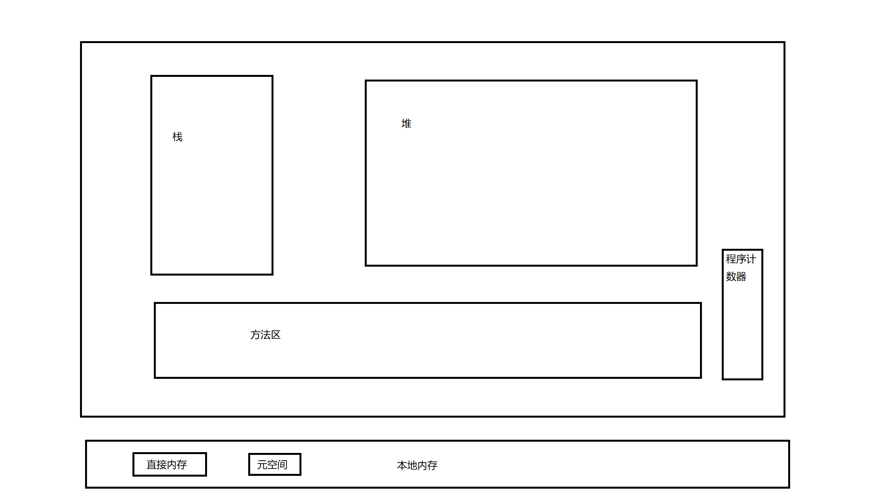

#### java内存模型

#### 垃圾回收

### 各区域作用

- 程序计数器：记录当前线程执行的字节码行数，字节码解析器的工作是通过改变这个计数器的值，来选取下一条需要执行的字节码指令。分支、循环、跳转、异常处理、线程恢复等基础功能，都依赖程序计数器来完成。
- Java 虚拟机栈（Java Virtual Machine Stacks）：存储局部变量表，操作数栈，动态链接，方法出口等信息。
- 本地方法栈（Native Method Stack）：与Java虚拟机栈的作用是一样的，只不过Java虚拟机栈是服务于Java方法的，本地方法栈是为虚拟机调用Native方法服务的。
- Java堆（Java Heap）：存储对象实例
- 方法区（Method Area）：存储已经被虚拟机加载的类数据，常量，静态变量，即时编译后的代码等数据。

### 说一下堆栈的区别

1. 物理地址不一样。堆的物理地址是不连续的，栈是连续的，栈的性能要大于堆
2. 内存大小不一样，堆一般远大于栈
3. 存储内容不一样，栈存储的是局部变量表，操作数栈，动态链接，方法出口等信息，堆存放的是对象的实例
4. 堆是线程共享的，栈区是线程独立的

### [深拷贝](https://so.csdn.net/so/search?q=深拷贝&spm=1001.2101.3001.7020)和浅拷贝

- 浅拷贝（shallow Copy）: 浅拷贝只是增加了一个指针指向被拷贝的内存地址
- 深拷贝（deep Copy）：增加了一个新的指针指向了新的内存地址

### java中提供的几种对象创建方式

| Header                             | 解释             |
| ---------------------------------- | ---------------- |
| 使用new关键字                      | 调用了构造函数   |
| 使用Class的newInstance方法         | 调用了构造函数   |
| 使用Constructor类的newInstance方法 | 调用了构造函数   |
| 使用clone方法                      | 没有调用构造函数 |
| 使用反序列化                       | 没有调用构造函数 |

### Java会存在内存泄漏吗？实际遇到过吗？

java理论上存在GC回收机制，不再使用的对象会被GC回收掉。但即使这样也存在内存泄漏情况，长生命周期的对象持有短生命周期的对象的引用就会发生内存泄漏现象，尽管短生命周期的对象已不再被使用，但因为长生命周期的对象持有它的引用而无法被回收，这就是内存泄漏发生的场景。

比如：1.HashMap，LinkedList等容器被设为static，那么它们的生命周期与程序一致，则容器的对象在程序结束前不能被释放，从而造成内存泄漏。2.数据库连接时没有调用close方法关闭连接。

### GC垃圾回收器

GC采用有向图的方式记录和管理堆中的所有对象，去判断哪些对象是可达或不可达的，当GC确定一些对象为不可达时，GC就有责任回收这些内存空间

程序员可以手动执行System.gc()通知GC运行，但JAVA虚拟机规范并不保证GC一定会执行。

### 垃圾回收算法

1. 标记-清除算法（简单，效率低）

   标记阶段：标记出可以回收的对象

   清除阶段：清除被标记的对象所占用的空间

2. 标记-复制算法

   为了解决效率问题，将内存划分为大小相同的两块，当一块的内存使用完只会，就将还存活的对象复制到另一块去，然后清除这一块的空间。

3. 标记-整理

   与标记-清除算法类似，不同的是在标记可回收对象后将所有的存活对象压缩到内存一端，然后对端边界以外的内存进行回收

4. 分代收集

   新生代使用标记-复制算法，老年代使用标记-清除和标记-整理算法

### 垃圾收集器

1. Serial收集器

   单线程收集器，简单高效

2. ParNew收集器

   Serial收集器的多线程版本

3. Parallel Scavenge收集器

   多线程收集器，主要关注点是吞吐量

4. Serial Old收集器

   Serial收集器的老年代版本

5. Parallel Old收集器

   Parallel Scavenge收集器的老年代版本

6. CMS收集器

   基于标记-清除算法实现的并发收集器，能使垃圾收集线程与用户线程同时工作，它更关注用户的体验，低停顿

7. G1收集器（高吞吐量，低停顿）

   G1收集器在后台维护了一个优先列表，每次根据允许的收集时间，优先回收价值最大的Region。

