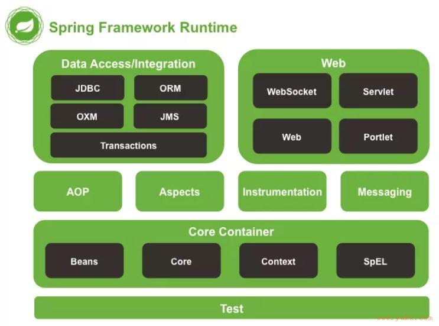

## Spring 概述
### 

### 什么是Spring？

Spring是一个轻量级Java开发框架，是为了解决企业级业务开发的业务逻辑层和其他层的耦合关系。Spring最根本是使命是简化Java开发，让Java开发者专注于程序的开发。

### Spring的优缺点

优点

1. 轻量级：Spring 是一个轻量级的框架，不需要依赖于其他第三方的软件包，只需要依赖于 JDK 就可以运行。
2. 松耦合：Spring 支持松耦合的设计模式，使用依赖注入（DI）和控制反转（IoC）实现了对象之间松耦合的关系。
3. 容器：Spring 提供了一个容器，用于管理应用程序中的对象的生命周期，这个容器可以自动创建、组装、管理对象之间的依赖关系。
4. AOP 功能：Spring 支持面向切面编程，通过 AOP 功能可以将某些非业务逻辑的功能（如安全性、事务、日志等）与业务逻辑分离出来，从而使代码更加清晰、易于维护。
5. 事务管理：Spring 提供了一个事务管理 API，可以在应用程序中管理事务，从而确保数据的一致性和可靠性。
6. 支持多种数据源：Spring 对 ORM 框架、JDBC 和其他数据访问 API 的支持使得使用多种数据源变得更加容易。

缺点

- 侵入式：在 Spring 框架中，很多的功能都是通过注解或 XML 配置文件来实现，这些注解和配置文件可能会让应用程序变得侵入式
- Spring依赖反射，反射影响性能

### Spring由哪些模块组成

- Spring Core：提供了框架最基本的组成部分，包括控制反转（IOC）和依赖注入(DI)功能。
- Spring Beans：提供了BeanFactory，是工厂模式的一个经典实现，Spring将管理对象称为Bean。
- SpringContext：负责实例化、配置和组装Bean
- Spring AOP：提供了面向切面的编程实现，可以自定义拦截器
- Spring Web：网络相关模块
- Spring Data Access：数据库相关模块
- SpringTest：测试相关模块

## 什么是控制反转和依赖注入

### IOC（Inverse of  Control）控制反转（重要）

控制反转指的是，由框架来控制对象的创建和生命周期，而不是由应用程序来直接管理。传统的程序设计中，对象的创建和依赖关系的管理通常由程序员来完成，而这样会导致应用程序之间的耦合度高、扩展性差。而控制反转将对象的创建和依赖关系的管理交给框架完成，框架可以根据配置文件或注解等方式来管理对象之间的依赖关系，提高了应用程序的可扩展性和可维护性。

### DI（Dependency Injection）依赖注入

依赖注入指的是，在创建一个对象时，将该对象所依赖的其他对象或资源通过构造方法或Setter方法注入到该对象中。依赖注入可以有效地解耦对象之间的依赖关系，提高了对象的复用性和可维护性。在Spring框架中，依赖注入是通过IoC容器来实现的。

### IOC流程

IoC的流程包括了BeanFactory容器的创建、Bean定义信息的加载、Bean实例化和初始化、BeanPostProcessor的注册和执行等多个环节

1. 创建BeanFactory容器，它是Spring IoC容器的实现者，负责实例化、配置和组装Bean，同时还管理Bean之间的依赖关系。在Spring中，BeanFactory是一个接口，有多个具体的实现类，如DefaultListableBeanFactory、XmlBeanFactory、ApplicationContext等。
2. 加载Bean的定义信息，通常是从XML配置文件或注解中读取Bean的定义信息，包括Bean的名称、类型、依赖关系等，然后把这些定义信息封装成BeanDefinition对象保存在BeanFactory中。
3. 配置BeanFactory的上下文特征，比如设置ClassLoader、资源加载器等。
4. 应用BeanFactoryPostProcessor，在BeanFactory标准初始化之后修改BeanFactory的Bean定义。BeanFactoryPostProcessor是一个扩展点，可以自定义实现该接口来修改BeanFactory中的Bean定义。
5. 注册BeanPostProcessor，它是IoC容器在实例化Bean的过程中调用的扩展点。它可以在实例化Bean的前后执行自定义的逻辑。例如，Spring提供的AutowiredAnnotationBeanPostProcessor会扫描Bean中的@Autowired注解，将被注入的Bean注入到该Bean中。
6. 实例化Bean，包括创建Bean实例、依赖注入、初始化等。在创建Bean实例时，如果该Bean实现了InitializingBean接口，则会调用afterPropertiesSet()方法；如果定义了init-method，则会调用该方法。在依赖注入时，如果该Bean实现了BeanPostProcessor接口，则会调用postProcessBeforeInitialization()方法，在初始化完成后会调用postProcessAfterInitialization()方法。
7. 如果Bean是单例的，则会将其缓存在IoC容器中，供后续使用。
8. 容器关闭时，会触发Bean销毁的回调方法。如果Bean实现了DisposableBean接口，则会调用destroy()方法；如果定义了destroy-method，则会调用该方法。

### BeanFactory & ApplicationContext

BeanFactory和ApplicationContext是Spring的两大核心接口，都可以当做Spring的容器。ApplicationContext是BeanFactory的子接口。

- BeanFactory：是Spring里面最底层的接口，包含了各种Bean的定义，控制bean的生命周期，维护bean之间的依赖关系。
- ApplicationContext：是一个高级容器，它比BeanFactory多了很多功能。它支持加载文件资源，国际化，事件发布通知，为bean配置懒加载等功能。


## Spring Beans

### 什么是SpringBean？

一句话，被IoC容器管理的对象。

我们需要告诉IoC容器帮我们管理哪些对象，这个是通过配置元数据来定义的。配置元数据可以是XML文件、注解或Java配置类。

### 将一个类声明为Bean的注解有哪些？

- @Component：通用注解，
- @Repository：持久层（DAO）层注解
- @Service
- @Controller

### @Component和@Bean有什么区别？

`@Component`和`@Bean`是Spring中的两个关键注解，用于实现依赖注入和控制反转（IoC）的功能，但它们在使用和功能上有一些区别。

1. `@Component`注解是用于标识一个类为Spring的组件（Component），表示该类需要由Spring进行管理和实例化。可以将`@Component`应用于任何普通的Java类，将其纳入Spring的上下文中，使其成为可以被其他组件自动注入和使用的Bean。
2. `@Bean`注解通常用于配置类中的方法级别，用于声明一个由Spring管理的Bean实例。通过在配置类中使用`@Bean`注解，可以将方法的返回值注册为一个Bean，并将其纳入Spring的上下文中，以供其他组件使用。

主要区别如下：

- `@Component`用于标识类，使其成为Spring的组件；`@Bean`用于声明方法，将其返回值注册为Spring的Bean。
- `@Component`通常用于自动扫描和自动装配，通过组件扫描将其纳入Spring上下文中；`@Bean`通常用于显式配置，通过配置类中的方法将其注册为Bean。
- `@Component`可以应用于任何普通的Java类；`@Bean`通常应用于配置类中的方法。
- `@Component`不提供显式配置选项，而`@Bean`可以提供更多的配置选项，例如设置Bean的名称、作用域、初始化方法等。

### @Bean可以指定顺序吗？

是的，`@Bean`注解可以指定顺序。在Spring Framework中，`@Bean`注解支持定义Bean的加载顺序，以确保特定Bean在容器中的加载顺序。

使用`@Order`注解时，您可以在`@Bean`方法上添加`@Order`注解，并指定一个整数值来表示顺序。较小的值表示较高的优先级。例如：

```java
@Configuration
public class MyConfiguration {

    @Bean
    @Order(1)
    public MyBean firstBean() {
        return new MyBean();
    }

    @Bean
    @Order(2)
    public MyBean secondBean() {
        return new MyBean();
    }
}
```
### 注入Bean的注解有哪些？

- @Autowired：Spring提供的注解，默认注入方式是byType，可以用@Qualifier来显示指定名称
- @Resource：JDK提供的注解，默认是byName，可以用name属性来显示指定名称

### Bean的作用域

- singleton：唯一实例，Spring中的bean默认都是单例的
- prototype：每次请求都创建一个新的bean实例
- request：每次HTTP请求都产生一个新的bean，该bean仅在HTTP request内有效
- session：HTTP session内有效
- global-session：全局session作用域。Spring5已经没有了。

### Bean的生命周期（重要）


Spring Bean生命周期总的来说分四步

实例化 → 属性赋值 → 初始化 → 销毁

```java
protected Object doCreateBean(String beanName,RootBeanDefinition mbd,@Nullable Object[]args)throws BeanCreationException{
        BeanWrapper instanceWrapper=null;
        if(mbd.isSingleton()){
        instanceWrapper=(BeanWrapper)this.factoryBeanInstanceCache.remove(beanName);
        }

        if(instanceWrapper==null){
        // 实例化阶段
        instanceWrapper=this.createBeanInstance(beanName,mbd,args);
        }

        ...

        Object exposedObject=bean;

        try{
        // 属性赋值阶段
        this.populateBean(beanName,mbd,instanceWrapper);
        // 初始化阶段
        exposedObject=this.initializeBean(beanName,exposedObject,mbd);
        }catch(Throwable var18){
        ...
        }

        ...
        }
//销毁在容器关闭时调用
```

代码详见：https://github.com/coadfarmer/spring-demo-beanCycle

详细流程：

1. 实例化（Instantiation）：利用反射调用构造方法实例化Bean
2. 属性赋值（Populate）：调用set（）方法
3. 初始化（Initialization）
   1. 检查aware相关接口并执行实现的set方法（为了让bean获取spring容器中的服务）
      1. beanName
      2. beanClassLoader
      3. beanFactory
      4. environment
      5. EmbeddedValueResolver
      6. ResourceLoader
      7. ApplicationEventPublisher
      8. MessageSource
      9. ApplicationContext
      10. ServletContext
   2. 调用BeanPostProcessor中postProcess**Before**Initialization方法
   3. 初始化（如果实现了InitializingBean接口会在初始化前调用afterPropertiesSet）
   4. 调用BeanPostProcessor中postProcess**After**Initialization方法
4. 销毁（Destruction）
   1. DestructionAwareBeanPostProcessors 的postProcessBeforeDestruction方法
   1. 调用DisposableBean中的destroy（）方法
   2. 如果配置文件中定义了destroy-method属性，执行相应方法

### 单例Bean的线程安全问题

无状态Bean是线程安全的，有状态Bean是线程不安全的

- 无状态Bean：没有实例变量的对象，不能保存数据，是不变类。
- 有状态Bean：有实例变量的对象，能保存数据

解决方法：

- 把Bean的作用域改为prototype
- 使用ThreadLocal

## AOP

### 什么是AOP？（重要）

- AOP（Aspect Oriented Programming，面向切面编程）是一种编程范式，它旨在通过将横切关注点从业务逻辑中分离出来，提高代码的模块化、可重用性和可维护性。横切关注点是那些对于整个应用程序而言具有共性的功能，比如日志、事务管理、异常处理等。这些关注点通常会分散在应用程序的不同模块中，使用 AOP 可以将它们统一处理。

  AOP 的核心思想是通过将关注点模块化，实现代码的横向复用，使得多个模块共享同一个关注点的实现，而不是将代码复制粘贴到多个模块中。这样可以减少代码重复、提高代码的可维护性和可重用性。AOP 主要使用切面、连接点和通知等概念来实现对关注点的模块化处理。
- 实现原理：SpringAOP是基于动态代理的，如果要代理的对象实现了某个接口，那么SpringAOP会使用JDK动态代理去创建代理对象；如果没有实现接口，就会使用CGLIB代理创建代理对象。

### Spring  AOP和AspectJ AOP有什么区别

SpringAOP基于动态代理，属于运行时增强，AspectJ基于静态代理，属于编译时增强。

AspectJ的功能比Spring的功能更强大，而且速度更快。所以Spring直接集成了AspectJ。

## Spring

### Spring框架中用了哪些设计模式（重要）

- **工厂设计模式** : Spring 使用工厂模式通过 `BeanFactory`、`ApplicationContext` 创建 bean 对象。
- **代理设计模式** : Spring AOP 功能的实现。
- **单例设计模式** : Spring 中的 Bean 默认都是单例的。
- **模板方法模式** : Spring 中 `jdbcTemplate` 等以 Template 结尾的对数据库操作的类，它们就使用到了模板模式。
- **包装器设计模式** : 我们的项目需要连接多个数据库，而且不同的客户在每次访问中根据需要会去访问不同的数据库。这种模式让我们可以根据客户的需求能够动态切换不同的数据源（DataSource）。
- **观察者模式:** Spring 事件驱动模型就是观察者模式很经典的一个应用。
- **适配器模式** : Spring AOP 的增强或通知(Advice)使用到了适配器模式、spring MVC 中也是用到了适配器模式适配`Controller`。

### Spring事务

#### Spring 管理事务的方式有几种？

- **编程式事务** ： 在代码中硬编码(不推荐使用) : 通过 `TransactionTemplate`或者 `TransactionManager` 手动管理事务，实际应用中很少使用，但是对于你理解 Spring事务管理原理有帮助。
- **声明式事务** ： 在 XML 配置文件中配置或者直接基于注解（推荐使用） : 实际是通过 AOP 实现（基于`@Transactional` 的全注解方式使用最多）

#### Spring事务的传播行为？

Spring事务传播行为说的是，当多个事务同时存在的时候，Spring如何处理这些事务的行为

- **REQUIRED**：@Transactional默认传播行为，如果当前存在事务，就加入该事务，如果当前没有事务，就**创建一个新事务**。
- **REQUIRES_NEW**：创建新事务，无论当前存不存在事务，都创建新事务。
- **NESTED**：如果当前存在事务，则在**嵌套事务内执行**。如果当前没有事务，则按REQUIRED属性执行。
- SUPPORTS：支持当前事务，如果当前存在事务，就加入该事务，如果当前不存在事务，就**以非事务执行**。
- NOT_SUPPORTED：以非事务方式执行操作，如果当前存在事务，就把当前事务挂起。
- MANDATORY：支持当前事务，如果当前存在事务，就加入该事务，如果当前不存在事务，**就抛出异常**。
- NEVER：以非事务方式执行，如果当前存在事务，则抛出异常。

#### `@Transactional` 事务注解原理

**`@Transactional` 的工作机制是基于 AOP 实现的**，如果一个类或者一个类中的 public 方法上被标注`@Transactional` 注解的话，Spring
容器就会在启动的时候为其创建一个代理类，在调用被`@Transactional` 注解的 public 方法的时候，实际调用的是，`TransactionInterceptor` 类中的 `invoke()`
方法。这个方法的作用就是在目标方法之前开启事务，方法执行过程中如果遇到异常的时候回滚事务，方法调用完成之后提交事务。

### Spring是如何解决循环依赖的？

- 循环依赖：两个bean：A和B，A里面有B，B里面有A。初始化A时注入B，初始化B时注入A，这样就造成了一种循环。
- 解决方法：三级缓存，首先把所有的bean放到第三级缓存里，三级缓存是为了保证bean的唯一性。实例化之后的bean放入二级缓存，属性注入后的完整对象放入一级缓存中。


