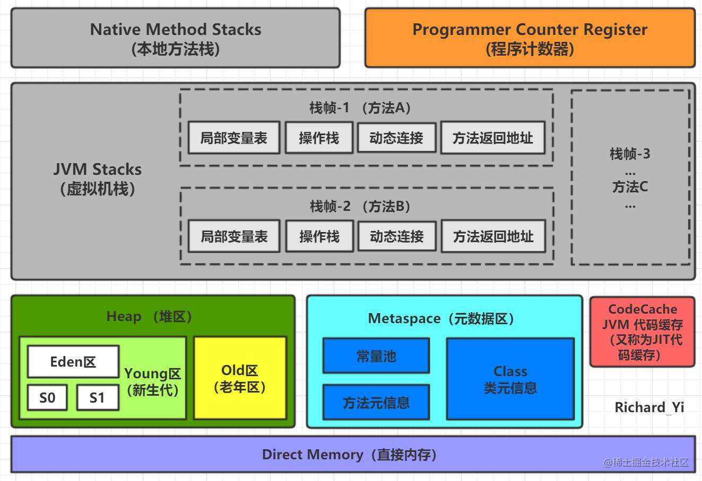

## JVM

### java内存模型

### 各区域作用

- 程序计数器：记录当前线程执行的字节码行数，字节码解析器的工作是通过改变这个计数器的值，来选取下一条需要执行的字节码指令。

  分支、循环、跳转、异常处理、线程恢复等基础功能，都依赖程序计数器来完成。

- Java 虚拟机栈（Java Virtual Machine Stacks）：

  1. 栈帧（Stack Frame）：每个方法在执行时都会创建一个栈帧，用于存储该方法的局部变量、操作数栈、方法返回值等。栈帧的大小在编译时就已经确定。
  2. 局部变量表（Local Variable Table）：局部变量表存储方法中定义的局部变量和参数。它包括基本数据类型（如整数、浮点数）、对象引用和returnAddress类型（用于保存返回地址的类型）。
  3. 操作数栈（Operand Stack）：操作数栈用于执行方法时的计算操作。它存储方法执行过程中的操作数和中间结果。例如，当方法调用一个方法时，参数会被推入操作数栈中。
  4. 动态链接（Dynamic Linking）：动态链接用于在运行时解析方法调用的目标。它包括常量池中方法的符号引用和直接引用。
  5. 返回值：执行方法后，方法返回的结果会被存储在Java虚拟机栈中，等待被调用方使用。

- 本地方法栈（Native Method Stack）：与Java虚拟机栈的作用是一样的，只不过Java虚拟机栈是服务于Java方法的，本地方法栈是为虚拟机调用Native方法服务的。

- Java堆（Java Heap）：存储对象实例。

  堆通常又可以再分为新生代，老生代和永久代。

  如下图所示Eden区，Survivor区（S0，S1）属于新生代，中间属于老年代，最下层属于永久代

  

  对象首先在Eden区分配空间，当一次垃圾回收完成之后，如果对象依然存活，则会从Eden转移到Survivor区，年龄加1。在Survivor区中年龄增加到一定岁数（默认是15岁,可以通过参数 `-XX:MaxTenuringThreshold`
  来设置），就会被晋升到老年代中。大对象会直接进入老年代。

  Java8之后永久代被元空间取代，元空间使用的是直接内存。

- 方法区（Method Area）：存储已经被虚拟机加载的类数据，常量，静态变量，即时编译后的代码等数据。

### 说一下堆栈的区别

1. 物理地址不一样。堆的物理地址是不连续的，栈是连续的，栈的性能要大于堆
2. 内存大小不一样，堆一般远大于栈
3. 存储内容不一样，栈存储的是局部变量表，操作数栈，动态链接，方法出口等信息，堆存放的是对象的实例
4. 堆是线程共享的，栈区是线程独立的

### [深拷贝](https://so.csdn.net/so/search?q=深拷贝&spm=1001.2101.3001.7020)和浅拷贝

- 浅拷贝（shallow Copy）: 只复制对象本身以及其引用的对象，而不复制对象引用的其他对象
- 深拷贝（deep Copy）：复制对象本身以及对象引用的所有对象

## 类加载

### java虚拟机的类加载过程

加载-验证-准备-解析-初始化

1. 加载（Loading）：该阶段将根据类的全限定名来读取该类的字节码文件，并将其加载到 JVM 内存中。加载过程的任务是将类的字节码数据读入到 JVM 中，并为之创建一个 java.lang.Class 对象，该对象用于封装类的各种属性。
2. 验证（Verification）：在此阶段，JVM 会验证类的字节码文件是否符合 Java 虚拟机规范，并检查它是否有安全方面的问题。例如，检查类的格式、语义等等。
3. 准备（Preparation）：在此阶段，JVM 会为该类的静态成员变量分配内存，并将其初始化为默认值。例如，整数类型的变量会被初始化为 0，对象类型的变量会被初始化为 null。
4. 解析（Resolution）：在此阶段，JVM 会将类、接口、字段和方法的符号引用解析为直接引用。例如，将字段和方法的引用解析为具体的内存地址，以便于 JVM 能够正确访问它们。
5. 初始化（Initialization）：在此阶段，JVM 会为该类的静态成员变量赋值，并执行静态代码块（即 static 代码块）中的代码。此阶段也会触发类的构造器方法（即 `<clinit>` 方法）的执行，它用于初始化类的状态。

需要注意的是，类的加载过程是延迟执行的，即只有在需要使用该类时才会加载。在 Java 程序中，类的加载通常是由类的第一次被主动使用触发的，例如创建对象、调用静态成员等等。

### 什么是类加载器，类加载器有哪些

实现通过类的权限定名获取该类的二进制的字节流代码块叫做类加载器。

主要有四种类加载器：

- 启动类加载器（Bootstrap ClassLoader），用来加载核心类库，无法被java程序直接使用。
- 扩展类加载器（Extensions Classloader），用来加载java的扩展库。
- 应用程序类加载器（Application Classloader），根据java应用的类（classpath）路径来加载java类，一般来说，java应用的类都是由它来加载完成的。
- 用户自定义类加载器，通过继承java.lang.ClassLoader类的方式实现

### 什么是双亲委派机制

当类加载器收到类加载请求时，它首先不会自己去加载这个类，而是把这个请求委派给父类加载器去完成，每一层的类加载器都是如此，这样所有的类加载请求都会被传送到顶层的启动类加载器中，只有当父加载器无法加载，子加载器才会去尝试加载。

### java中提供的几种对象创建方式

| Header                             | 解释             |
| ---------------------------------- | ---------------- |
| 使用new关键字                      | 调用了构造函数   |
| 使用Class的newInstance方法         | 调用了构造函数   |
| 使用Constructor类的newInstance方法 | 调用了构造函数   |
| 使用clone方法                      | 没有调用构造函数 |
| 使用反序列化                       | 没有调用构造函数 |

### JAVA中有哪些引用类型

- 强引用（默认）：只要引用存在，发生gc时不会被回收
- 软引用（SoftReference）：有用但不是必须的对象，在内存溢出之前会被回收
- 弱引用（WeakReference）：有用但不是必须的对象，在下一次GC时会被回收
- 虚引用（PhantomReference）：无法通过虚引用获得对象，用 PhantomReference 实现虚引用，虚引用的用途是在 gc 时返回一个通知。

### Java会存在内存泄漏吗？实际遇到过吗？

内存泄漏是指当应用程序在不需要使用某个对象时，该对象占用的内存没有被释放，导致内存空间被浪费。Java 中的垃圾回收机制可以帮助开发人员避免内存泄漏的问题，但仍然有些情况下可能会发生内存泄漏，比如：

1. 对象被创建后，但是没有被使用，也没有被设置为 null，导致垃圾回收机制无法回收该对象。
2. 静态集合类，例如 HashMap、ArrayList 等，如果没有及时清空，就会导致集合中的对象无法被释放，从而引起内存泄漏。
3. 对象使用了 JNI（Java Native Interface）功能，如果程序员没有使用正确的释放方式，就可能导致内存泄漏。
4. 当程序员在使用 IO 流的时候没有正确地关闭流对象，也会导致内存泄漏。
5. 内部类持有外部类的引用，如果外部类被销毁，但是内部类还在被使用，就会导致外部类的内存无法被回收。

### GC垃圾回收器

GC采用有向图的方式记录和管理堆中的所有对象，去判断哪些对象是可达或不可达的，当GC确定一些对象为不可达时，GC就有责任回收这些内存空间

程序员可以手动执行System.gc()通知GC运行，但JAVA虚拟机规范并不保证GC一定会执行。

### 垃圾回收算法

1. **标记-清除算法** 

   标记-清除算法是一种最基本的垃圾回收算法，其过程分为两个阶段：标记阶段和清除阶段。在标记阶段，垃圾回收器会标记所有仍然存活的对象，然后在清除阶段将未被标记的对象清除。标记-清除算法的缺点是会产生大量不连续的内存碎片，导致内存的使用效率降低。

2. **复制算法** 

   复制算法是将可用内存按照容量分为两个区域，每次只使用其中一个区域，当这个区域的内存用完后，将存活的对象复制到另一个区域，然后清空使用的区域，使两个区域交替使用。复制算法的优点是简单高效，缺点是需要额外的内存空间。

3. **标记-整理算法** 

   标记-整理算法是在标记-清除算法的基础上进行的优化，其主要思想是先标记存活对象，然后将存活对象移动到一端，然后将所有存活对象的另一端全部清除。这样可以避免产生内存碎片，但需要移动存活对象，效率较低。

4. **分代收集算法** 

   分代收集算法是根据对象的生命周期将堆内存分为新生代和老年代两个区域，根据不同区域采用不同的垃圾回收算法。新生代中，由于大部分对象的生命周期较短，采用复制算法进行垃圾回收；老年代中，由于对象生命周期较长，采用标记-清除算法或标记-整理算法进行垃圾回收。分代收集算法可以有效提高垃圾回收的效率，但需要合理设置新生代和老年代的比例。

### 垃圾收集器

1. Serial 收集器：Serial 收集器是一种单线程垃圾收集器，它采用复制算法进行垃圾回收，适用于小型应用和客户端环境。

2. Parallel 收集器：Parallel 收集器是一种多线程垃圾收集器，采用复制算法进行垃圾回收，适用于多核处理器和大型应用程序。
3. CMS 收集器：CMS（Concurrent Mark Sweep）收集器是一种并发垃圾收集器，采用标记-清除算法进行垃圾回收，可以与应用程序线程并发执行，适用于响应时间敏感的应用程序。
4. G1 收集器：G1（Garbage First）收集器是一种面向服务器的垃圾收集器，采用标记-整理算法进行垃圾回收，可以根据应用程序的内存需求和垃圾生成情况动态调整回收策略，适用于大型内存和多核处理器的应用程序。
5. ZGC 收集器：ZGC（Z Garbage Collector）是一种并发垃圾收集器，采用标记-整理算法进行垃圾回收，可以实现极短的停顿时间（不超过 10ms）和极高的吞吐量，适用于大型内存和高吞吐量的应用程序。

### JVM调优

#### JVM调优工具简介

在JDK安装目录的bin目录下，有很多jdk调优工具，其中命令行工具有比如：

- jps（JVM Process Status）:查看所有java进程;
- jstat（JVM Statistics Monitoring Tool）：查看某个java进程的运行数据;
- jmap（Memory Map for Java）：生成堆转储快照
- jstack（Stack Trace for Java）：生成当前时刻的线程快照

可视化工具

- JConsole：用于对JVM中内存、线程和类进行监控。
- JVisualVM：JDK 自带的全能分析工具，可以分析：内存快照、线程快照、程序死锁、监控内存的变化、gc 变化等。

#### 常用的调优参数

- -Xms2g：初始化推大小为 2g；
- -Xmx2g：堆最大内存为 2g；
- -XX:NewRatio=4：设置年轻的和老年代的内存比例为 1:4；
- -XX:SurvivorRatio=8：设置新生代 Eden 和 Survivor 比例为 8:2；
- -XX:MetaspaceSize=256m： 元数据空间的初始大小256m；
- -XX:+UseConcMarkSweepGC：使用CMS收集器收集；
- -XX:+PrintGC：开启打印 gc 信息；
