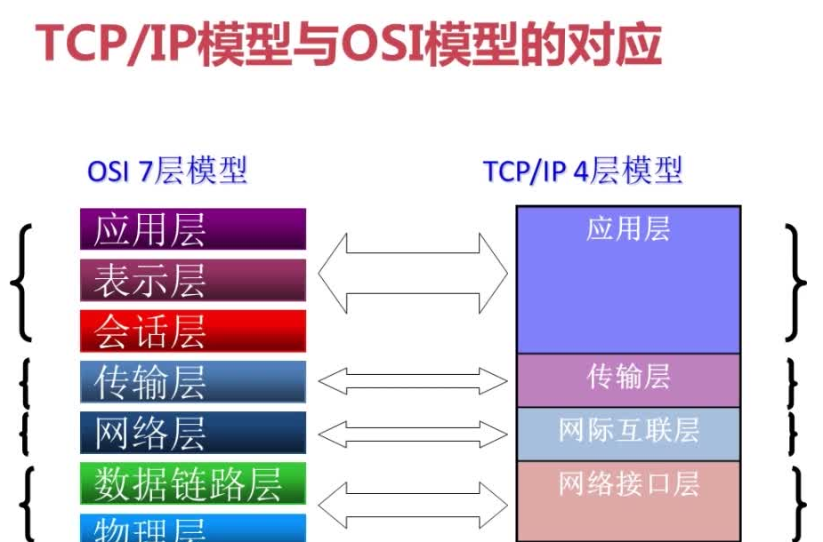
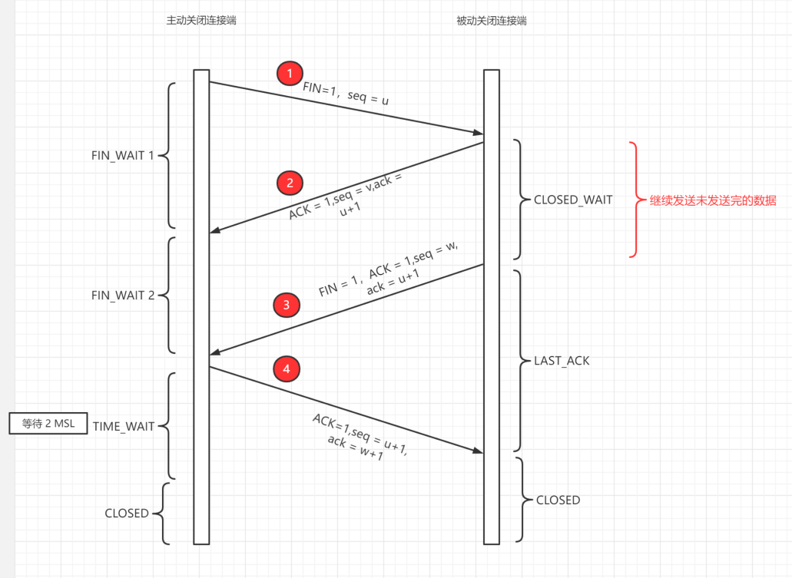

# 计算机网络

OSI七层模型（了解）

## TCP/IP四层模型

1. 应用层
2. 传输层
3. 网络层
4. 网络接口层

TCP/IP四层模型与OSI模型对应关系：

### 1.应用层（Application Layer）

应用层是体系结构中的最高层。应用层的任务是通过应用进程间的交互。应用层协议定义的是应用进程间通信和交互的规则。对于不同的网络应用需要不同的协议。比如域名系统DNS，支持万维网应用的HTTP协议，支持电子邮件的SMTP协议等等。我们把应用层交互的数据单元称作报文（message）

### 2.运输层（transport layer）

运输层的任务就是负责向两台主机之间的通信提供通用数据传输服务。

运输层主要使用以下两种协议：

- TCP：提供面向连接的，可靠的数据传输服务，数据传输的单位是报文段
- UDP：提供无连接的，尽最大努力的数据传输服务，数据传输的单位是用户数据报

#### TCP报文段

TCP报文由头部和数据两部分组成。首部由20-60字节组成，其中前20固定，后40可选

1. **源端口和目的端口**，各占2字节，分别写入源端口号和目的端口号。

2. **序号**（seq），占4字节。序号用来标识从TCP发送端向接收端传输的字节流进行编号

   例如，一报文段的序号字段是301，而携带的数据共有100个字节，那么下一个报文段的序号应从401开始

3. **确认号**（ack），占4字节。期望收到对方下一个报文段的第一个数据字节的序号，确认号只有在ACK标志为1时才有用。

   若确认号ack = N，则标识序号N-1为止的所有数据都已正确收到

4. **数据偏移**，占4位。它指出TCP报文段的数据起始处距离TCP报文段的起始处有多远。

5. **保留**，占6位，暂时保留，没用

6. **标志位**

    - **URG**：紧急标志位，说明紧急指针有效
    - **ACK**：确认标志位，说明确认号有效
    - **SYN**：同步标志，在建立连接时用来同步序号，当SYN=1,ACK=0时说明是一个连接请求报文段；同意连接则把ACK置1
    - **FIN**：终止标志，当FIN=1时表示连接结束
    - **PSH**：推送标志位，接收方接到后立即向应用层推送，而不是等到缓存满了再向上交付
    - **RST**：复位标志，说明TCP连接中出现了严重差错，必须释放并重新连接

#### TCP协议如何保证可靠传输

1. 确认机制：TCP 协议在发送数据时，会让接收方发送确认信息（ACK）来表明已经成功接收到了数据，如果发送方没有收到确认信息，就会重发数据，直到收到确认信息为止。
2. 序号机制：TCP 协议会对每个数据包进行编号，这样接收方可以按照顺序将数据包组装成完整的数据流。如果发送方发送的某个数据包没有得到确认信息，就会重发该数据包，确保接收方能够按照正确的顺序接收到所有数据。
3. 滑动窗口机制：TCP 协议通过滑动窗口机制来控制数据的发送和接收。发送方会维护一个发送窗口，接收方会维护一个接收窗口，发送方根据接收方的窗口大小来确定可以发送的数据量，从而避免了发送方过快发送数据导致接收方无法处理的情况。
4. 超时重传机制：如果发送方发送了一个数据包但是在一定时间内没有收到确认信息，就会认为该数据包丢失了，从而触发重传机制。发送方会重新发送该数据包，直到接收方确认接收到为止。
5. 流量控制：TCP 协议还可以通过流量控制机制来避免网络拥塞。发送方会根据接收方的反馈来调整发送数据的速率，从而避免网络拥塞导致数据丢失的情况。

### 3.网络层（NetWork Layer）

**网络层负责为分组交换网上的不同主机提供通信服务。**在发送数据时，网络层把运输层的数据封装成分组和包进行传送。**网络层使用的是IP协议。**

IP包格式：

IP数据包是一种可变长分组，它由首部和数据负载两部分组成。首部长度一般为20-60字节（Byte），其中后40字节是可选的，长度不固定，前20字节格式为固定。数据负载部分的长度一般可变，整个IP数据包的最大长度为65535B。

### 4.网络接口层

网络接口层包括以下两层

1. 数据链路层（data link layer）

   数据链路层是作用是将网络层交下来的IP数据组装成帧，在两个相邻节点间的链路上传送帧。每一帧包括数据和必要的控制信息（如同步信息、地址信息、差错控制等）。

2. 物理层（physical layer）

   物理层是作用是实现相邻节点间比特流的透明传送，尽可能屏蔽掉传输介质和物理设备的差异。

## 三次握手和四次挥手

1. A将同步标志位置1，序号x请求连接服务器；
2. B发送ACK=1,SYN=1表示同意连接，序号seq=y，ack=x+1；
3. A收到B的确认后，还要向B给出确认，ACK = 1，seq = x +1 ，ack = y+1

#### 为什么需要三次握手

主要是为了确认双方的发送接收都正常

#### 为什么要四次挥手

因为要双方都确认结束才是真正结束了。

## 在浏览器中输入 url 地址发生了什么

1. DNS 解析
2. TCP 连接
3. 发送 HTTP 请求
4. 服务器处理请求并返回 HTTP 报文
5. 浏览器解析渲染页面
6. 连接结束
