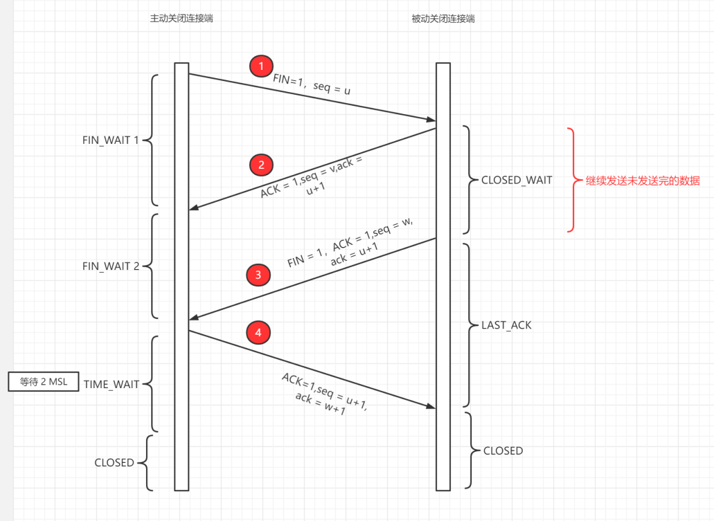

# 计算机网络

OSI七层模型（了解）

## TCP/IP四层模型

1. 应用层
2. 传输层
3. 网络层
4. 网络接口层

TCP/IP四层模型与OSI模型对应关系：

### 1.应用层（Application Layer）

应用层是体系结构中的最高层。应用层的任务是通过应用进程间的交互来完成特定网络应用。应用层协议定义的是应用进程间通信和交互的规则。对于不同的网络应用需要不同的协议。比如域名系统DNS，支持万维网应用的HTTP协议，支持电子邮件的SMTP协议等等。我们把应用层交互的数据单元称作报文（message）

### 2.运输层（transport layer）

运输层的认识就是负责向两台主机之间的通信提供通用数据传输服务。

运输层主要使用以下两种协议：

- TCP：提供面向连接的，可靠的数据传输服务，数据传输的单位是报文段
- UDP：提供无连接的，尽最大努力的数据传输服务，数据传输的单位是用户数据报

#### TCP报文段

TCP报文由头部和数据两部分组成。首部由20-60字节组成，其中前20固定，后40可选

1. **源端口和目的端口**，各占2字节，分别写入源端口号和目的端口号。

2. **序号**（seq），占4字节。序号用来标识从TCP发送端向接收端传输的字节流进行编号

   例如，一报文段的序号字段是301，而携带的数据共有100个字节，那么下一个报文段的序号应从401开始

3. **确认号**（ack），占4字节。期望收到对方下一个报文段的第一个数据字节的序号，确认号只有在ACK标志为1时才有用。

   若确认号ack = N，则标识序号N-1为止的所有数据都已正确收到

4. **数据偏移**，占4位。它指出TCP报文段的数据起始处距离TCP报文段的起始处有多远。

5. **保留**，占6位，暂时保留，没用

6. **标志位**

   - **URG**：紧急标志位，说明紧急指针有效
   - **ACK**：确认标志位，说明确认号有效
   - **PSH**：推送标志位，接收方接到后立即向应用层推送，而不是等到缓存满了再向上交付
   - **RST**：复位标志，说明TCP连接中出现了严重差错，必须释放并重新连接
   - **SYN**：同步标志，在建立连接时用来同步序号，当SYN=1,ACK=0时说明是一个连接请求报文段；同意连接则把ACK置1
   - **FIN**：终止标志，当FIN=1时表示连接结束

#### TCP协议如何保证可靠传输

1. 应用数据被分割成 TCP 认为最适合发送的数据块。
2. TCP 给发送的每一个包进行编号，接收方对数据包进行排序，把有序数据传送给应用层。
3. **校验和：** TCP 将保持它首部和数据的检验和。这是一个端到端的检验和，目的是检测数据在传输过程中的任何变化。如果收到段的检验和有差错，TCP 将丢弃这个报文段和不确认收到此报文段。
4. TCP 的接收端会丢弃重复的数据。
5. **流量控制：** TCP 连接的每一方都有固定大小的缓冲空间，TCP 的接收端只允许发送端发送接收端缓冲区能接纳的数据。当接收方来不及处理发送方的数据，能提示发送方降低发送的速率，防止包丢失。TCP
   使用的流量控制协议是可变大小的滑动窗口协议。 （TCP 利用滑动窗口实现流量控制）
6. **拥塞控制：** 当网络拥塞时，减少数据的发送。
7. **ARQ（自动重传系统） 协议：** 也是为了实现可靠传输的，它的基本原理就是每发完一个分组就停止发送，等待对方确认。在收到确认后再发下一个分组。
8. **超时重传：** 当 TCP 发出一个段后，它启动一个定时器，等待目的端确认收到这个报文段。如果不能及时收到一个确认，将重发这个报文段。

### 3.网络层（NetWork Layer）

**网络层负责为分组交换网上的不同主机提供通信服务。**在发送数据时，网络层把运输层的数据封装成分组和包进行传送。**网络层使用的是IP协议。**

IP包格式：

IP数据包是一种可变长分组，它由首部和数据负载两部分组成。首部长度一般为20-60字节（Byte），其中后40字节是可选的，长度不固定，前20字节格式为固定。数据负载部分的长度一般可变，整个IP数据包的最大长度为65535B。

1、版本号（Version）

长度为4位（bit），IP v4的值为0100，IP v6的值为0110。

2、首部长度

指的是IP包头长度，用4位（bit）表示，十进制值就是[0,15]，一个IP包前20个字节是必有的，后40个字节根据情况可能有可能没有。如果IP包头是20个字节，则该位应是20/4=5。

3、服务类型（Type of Service TOS）

长度为8位（bit），其组成：前3位为优先级（Precedence），后4位标志位，最后1位保留未用。优先级主要用于QoS，表示从0（普通级别）到7（网络控制分组）的优先级。标志位可分别表示D（Delay更低的时延）、T（Throughput
更高的吞吐量）、R（Reliability更高的可靠性）、C（Cost 更低费用的路由）。

TOS只表示用户的请求，不具有强制性，实际应用中很少用，路由器通常忽略TOS字段。

4、总长度（Total Length）

指IP包总长度，用16位（bit）表示，即IP包最大长度可以达216=65535字节。在以太网中允许的最大包长为1500B，当超过网络允许的最大长度时需将过长的数据包分片。

5、标识符（Identifier）

长度为16位，用于数据包在分段重组时标识其序列号。将数据分段后，打包成IP包，IP包因走的路由上不同，会产生不同的到达目地的时间，到达目地的后再根据标识符进行重新组装还原。该字段要与标志、段偏移一起使用的才能达到分段组装的目标。

6、标志（Flags）

长度为3位，三位从左到右分别是MF、DF、未用。MF=1表示后面还有分段的数据包，MF=0表示没有更多分片（即最后一个分片）。DF=1表示路由器不能对该数据包分段，DF=0表示数据包可以被分段。

7、偏移量（Fragment Offset）

也称段偏移，用于标识该数据段在上层初始数据报文中的偏移量。如果某个包含分段的上层报文的IP数据包在传送时丢失，则整个一系列包含分段的上层数据包的IP包都会要求重传。

8、生存时间（TTL）

长度为8位，初始值由操作系统设置，每经过一个路由器转发后其值就减1，减至0后丢弃该包。这种机制可以避免数据包找不到目地时不断被转发，堵塞网络。

9、协议（Protocol）

长度为8位，标识上层所使用的协议。

10、首部校验和（Header Checksum）

长度为16位，首部检验和只对IP数据包首部进行校验，不包含数据部分。数据包每经过一个中间节点都要重新计算首部校验和，对首都进行检验。

11、源IP地址（Source IP）

长度为32位，表示数据发送的主机IP。

12、目的IP地址（Destination IP）

长度为32位，表示数据要接收的主机IP。

13、选项字段（Options）

长度为0-40字节（Byte），主要有：安全和处理限制（Security）、记录路径（Record Route）、时间戳（Timestamps）、宽松源站选路（Loose Source Routing）、严格的源站选路（Strict
Source Routing）等。

### 4.网络接口层

网络接口层包括以下两层

1. 数据链路层（data link layer）

   数据链路层是作用是将网络层交下来的IP数据组装成帧，在两个相邻节点间的链路上传送帧。每一帧包括数据和必要的控制信息（如同步信息、地址信息、差错控制等）。

2. 物理层（physical layer）

   物理层是作用是实现相邻节点间比特流的透明传送，尽可能屏蔽掉传输介质和物理设备的差异。

## 三次握手和四次挥手

1. A将同步标志位置1，序号x请求连接服务器；
2. B发送ACK=1,SYN=1表示同意连接，序号seq=y，ack=x+1；
3. A收到B的确认后，还要向B给出确认，ACK = 1，seq = x +1 ，ack = y+1

#### 为什么需要三次握手

主要是为了确认双方的发送接收都正常

#### 为什么要四次挥手

因为要双方都确认结束才是真正结束了。

## 在浏览器中输入 url 地址发生了什么

1. DNS 解析
2. TCP 连接
3. 发送 HTTP 请求
4. 服务器处理请求并返回 HTTP 报文
5. 浏览器解析渲染页面
6. 连接结束
